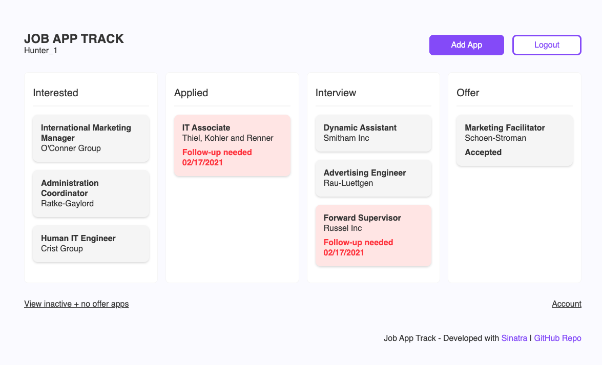

# Job App Track

## Description

This Sinatra-based app provides a simple way for job seekers to organize and track job application details, including an application's status (interested, applied, interview, etc.) and follow-up actions needed. 

Dashboard view
 

Add, edit, and remove application logs and related follow-up actions
 

## Installation and Usage

Fork and clone this repo to your local machine. In your terminal, make sure you're in the project's main directory then run the command `bundle install` to install dependencies. 

Run the migrations next to set up your database by using the command `rake db:migrate` in your terminal.

To seed your datbase with dummy-data, use the command `rake db:seed`.

To view the app on your local host, run the command `shotgun` then use your browser to navigate to the port listed ( port 3000).

## Contributing

Bug reports and pull requests are welcome on GitHub at https://github.com/staceymck/job-app-track. This project is intended to be a safe, welcoming space for collaboration, and contributors are expected to adhere to the [code of conduct](https://github.com/staceymck/job-app-track/blob/main/CODE_OF_CONDUCT.md).

## License

The project is available as open source under the terms of the [MIT License](https://opensource.org/licenses/MIT).

## Code of Conduct

Everyone interacting in the JobAppTrack project’s codebases, issue trackers, chat rooms and mailing lists is expected to follow the [code of conduct](https://github.com/staceymck/job-app-track/blob/main/CODE_OF_CONDUCT.md).